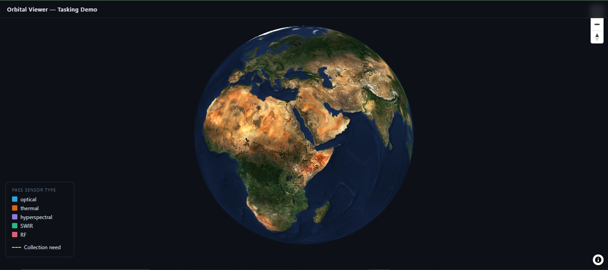

# Orbital Viewer

Satellite tasking visualization — a miniature mission-control demo, modelling the problem space of collection tasking and geospatial catalogue search.

**Live demo: https://geo.fahadbilal.com**



## Overview

Orbital Viewer matches collection needs (where a customer wants imagery) against satellite passes and real archived acquisitions (where satellites actually looked), on an interactive 3D globe — computing spatial intersection, time-window eligibility, and cloud-cover compliance in the database, in real time. You can also draw a new area of interest directly on the globe and get coverage matches back live.

**What's real and what's simulated** (stated plainly, because it matters):

| Element | Real / simulated |
|---|---|
| Basemap imagery | **Real** — EOX Sentinel-2 cloudless 2023 mosaic |
| Geography & coordinates | **Real** — AOIs at real Gulf locations |
| Spatial computation | **Real** — PostGIS `ST_Intersects` / `ST_Area`, genuine math |
| Satellite orbit tracks | **Real** — live TLEs from CelesTrak, propagated with SGP4 |
| Archived acquisitions | **Real** — live Sentinel-2 L2A from the Copernicus STAC API |
| Simulated passes ("Altair") | **Simulated** — a seeded fictional constellation for the tasking demo |
| Collection needs | **Simulated** — real customer tasking is confidential |

The principle: real where it can be (geography, imagery, orbits, computation), simulated only where it must be (customer tasking data), labelled honestly throughout. This is a portfolio demonstration, not an operational system.

## Stack

| Layer | Technology |
|---|---|
| Spatial database | PostgreSQL 16 + PostGIS 3.4, GiST-indexed geometry |
| API | FastAPI + asyncpg (no ORM), GeoJSON responses |
| Frontend | React 19 + TypeScript + Vite, MapLibre GL JS v5 (globe projection) |
| Orbit propagation | satellite.js (SGP4) over live CelesTrak TLEs |
| Imagery catalogue | Copernicus Data Space STAC API (Sentinel-2 L2A) |
| Basemap | EOX Sentinel-2 cloudless 2023 (WMTS, free tier) |
| Infrastructure | Docker Compose, nginx, Cloudflare, GitHub Actions CI/CD |

## How it works

The core match joins footprints against a collection need on three filters — spatial overlap, time window, and cloud cover — and runs against **both** the simulated passes and the real Sentinel-2 acquisitions, unioned with a `source` label:

```sql
WHERE ST_Intersects(footprint, aoi)
  AND <time field> BETWEEN window_start AND window_end
  AND cloud_cover_pct <= max_cloud
```

Coverage is the real intersection area: `ST_Area(ST_Intersection(footprint, aoi)::geography) / 1e6` (km²). The `::geography` cast matters — `ST_Area` on raw SRID-4326 geometry returns square degrees, not metres. GiST indexes let PostGIS pre-filter candidates by bounding box before exact intersection tests.

Three ways to use it:
- **Click a seeded collection need** → `GET /api/needs/{id}/matches` runs the match and lists results in the popup, with simulated-pass vs real-Sentinel-2 sources labelled.
- **Draw an AOI on the globe** → `POST /api/match` runs the same logic against your drawn polygon and chosen constraints, ephemerally (no DB write).
- **Toggle live orbits** → real satellites (Sentinel-2A/2B, Landsat 8/9, Sentinel-1A) propagated from current TLEs, rendered as near-polar ground tracks.

Real Sentinel-2 acquisitions are ingested separately via `api/scripts/ingest_sentinel.py` (run manually, not in CI/CD — real-data ingestion is a deliberate, supervised action).

## API

| Method | Path | Description |
|---|---|---|
| GET | `/api/health` | Liveness + DB connectivity check |
| GET | `/api/passes` | Simulated passes as GeoJSON (filters: `sensor`, `max_cloud`, `start`, `end`) |
| GET | `/api/needs` | Collection needs as GeoJSON |
| GET | `/api/acquisitions` | Real Sentinel-2 acquisitions as GeoJSON |
| GET | `/api/needs/{id}/matches` | Passes + real acquisitions satisfying a need; `source`-tagged |
| POST | `/api/match` | Ephemeral match for a user-drawn AOI + constraints (no DB write) |
| GET | `/api/tles` | CelesTrak TLE proxy for 5 real satellites; cached 1h, stale-fallback |
| GET | `/metrics` | Prometheus metrics (request counts, latency, pass total gauge) |

## Running locally

```bash
cp .env.example .env
# Set POSTGRES_PASSWORD at minimum; other defaults are fine for local dev
docker compose up --build -d
```

The API is available at `http://localhost:8200/api/health`.

For frontend hot-reload during development:

```bash
cd web
npm install
npm run dev   # http://localhost:5173
```

Vite proxies `/api/*` to `http://localhost:8200` in dev mode, so no CORS configuration is needed locally. To ingest real Sentinel-2 data, run `python api/scripts/ingest_sentinel.py` against a running database.

## Design decisions

**Docker Compose over Kubernetes.** One VPS, a few containers, no autoscaling requirement. Compose is proportionate; Kubernetes would be operational overhead with no benefit here.

**Real orbits and real imagery, simulated tasking.** Orbital mechanics (TLE/SGP4) and archived acquisitions (Copernicus STAC) are the hard-to-fake parts, so they're real. Customer collection needs are commercially confidential in any real system, so simulating them is the correct choice — not a shortcut.

**Hand-rolled match query.** A production tasking system would sit behind a STAC catalogue (e.g. pgstac) and vector tiles. The SQL here is intentionally transparent so the matching logic is auditable without domain-specific tooling.

**Custom draw tool over a draw library.** External draw libraries fight MapLibre's globe projection, so the AOI tool is a lightweight custom two-click bbox. User-drawn geometry is parameterised into PostGIS via `ST_SetSRID(ST_GeomFromGeoJSON($1), 4326)` — never string-interpolated.

**AI-assisted development.** Built with Claude Code under human review. Architecture decisions, data design, and correctness checks remained with the author; changes were verified against the running system before commit.

## CI/CD

GitHub Actions runs on every push and pull request to `main`:

- **api job**: PostGIS service container, ruff lint, schema + seed load, pytest against the live DB
- **web job**: `npm ci`, TypeScript typecheck (`tsc -b --noEmit`), Vite production build
- **deploy job** (push to `main` only, after api + web pass): SSH to the VPS, pull, and rebuild the production stack — so a green build auto-deploys to the live demo.
